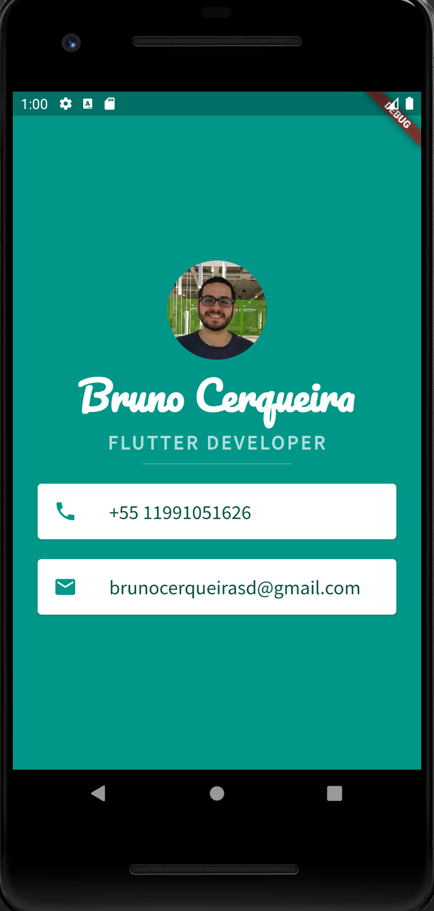

# Mi Card

<!-- PROJECT  -->
 

  

  <h3 align="center">Studying Flutter!</h3>
  

<!-- TABLE OF CONTENTS -->

## Table of Contents

- [About the Project](#about-the-project)
  - [Built With](#built-with)
  - [Run App](#run-app)
  - [Further Help](#further-help)
- [What I will learn](#what-i-will-learn)
- [Roadmap](#roadmap)
- [Contact](#contact)
- [Acknowledgements](#acknowledgements)

<!-- ABOUT THE PROJECT -->

## About The Project

Flutter is Google’s UI toolkit for building beautiful, natively compiled applications for mobile, web, and desktop from a single codebase. This is project is to practice flutter and learn having fun!

### Built With

- [Flutter](https://flutter.dev/)

### Run App

Run `flutter run` to build the project. the project will be running on a virtual device.

### Further help

Visit the [Flutter docs](https://flutter.dev/docs).

## What I will learn

- How to create Stateless Widgets
- What is the difference between hot reload and hot refresh and running an app from cold
- How to use Containers to lay out your UI
- How to use Columns and Rows to position your UI elements
- How to add custom fonts
- How to add Material icons
- How to style Text widgets
- How to read and use Flutter Documentation

<!-- ROADMAP -->

## Roadmap

See the [open issues](https://github.com/Bruno-Cerqueira/mi_card_flutter/issues) for a list of proposed features (and known issues).

<!-- CONTACT -->

## Contact

Bruno Cerqueira - brunocerqueirasd@gmail.com

Project Link: [https://github.com/Bruno-Cerqueira/mi_card_flutter](https://github.com/Bruno-Cerqueira/mi_card_flutter)

<!-- ACKNOWLEDGEMENTS -->

## Acknowledgements

[Amaizing flutter course](https://www.udemy.com/course/flutter-bootcamp-with-dart/)
[Based Github project](https://github.com/londonappbrewery/mi_card_flutter)
